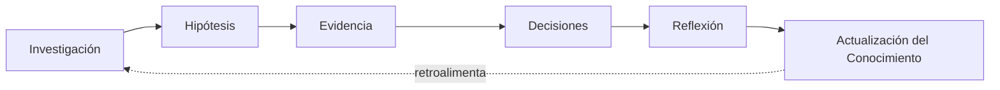
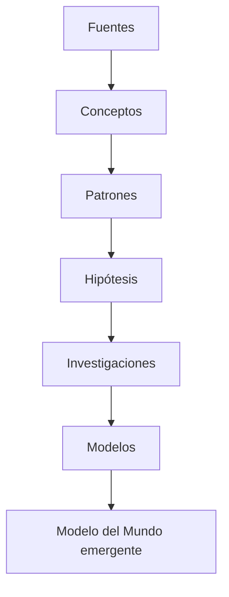

# Arquitectura Cognitiva del Sistema

## 1. Propósito de este documento

Este documento describe la arquitectura completa del Sistema de Amplificación Cognitiva Personal (SACP), tal como se establece en el [[Manifiesto del Proyecto - SACP]]. Su función es explicar cómo se relacionan entre sí los distintos componentes del sistema: qué hace cada uno, qué no hace, y cómo fluye el conocimiento y el razonamiento entre ellos.

Es el documento maestro de referencia para entender la arquitectura. Cualquier duda sobre "dónde vive" una capacidad del sistema, o "quién es responsable" de una función, debe resolverse consultando primero este documento.

## 2. Los tres componentes del sistema

El SACP está compuesto por tres partes que cumplen funciones distintas y complementarias:

1. **Memoria** — implementada en Obsidian. Conserva, organiza y conecta el conocimiento. No razona.
2. **Motores Cognitivos** — comportamiento de la IA, guiado por los protocolos documentados en `Sistema/Cognición/`. Razonan, investigan, formulan hipótesis, evalúan evidencia, deciden, reflexionan y actualizan el conocimiento.
3. **Interfaz Conversacional** — el punto de contacto entre el usuario y el sistema. Es donde la Memoria y los Motores Cognitivos se combinan para producir una respuesta.

Ninguno de estos tres componentes sustituye a los otros. La Memoria sin los Motores Cognitivos es solo un archivo. Los Motores Cognitivos sin la Memoria son un razonador sin contexto personal. La Interfaz sin ambos es un chatbot genérico — exactamente lo que el Manifiesto declara que este proyecto no busca ser.

## 3. La Memoria en detalle

La Memoria se organiza en tres niveles de conocimiento, más un modelo paralelo del usuario.

### Nivel 1 — Conocimiento atómico

Unidades mínimas de conocimiento, cada una en su propia nota: `Conceptos/`, `Investigaciones/`, `Descubrimientos/`, `Patrones/`, `Hipótesis/`, `Fuentes/`, `Decisiones/`. A estas se suman las carpetas de contexto operacional: `Proyectos/`, `Personas/`, `Conversaciones/`.

### Nivel 2 — Modelos

La carpeta `Modelos/` contiene síntesis de varias piezas de Nivel 1 en explicaciones coherentes sobre un dominio. Un Modelo integra conceptos, patrones e hipótesis relacionadas en una estructura con poder explicativo y predictivo. Ver [[Epistemología del Sistema]] para los criterios exactos de cuándo una Hipótesis se convierte en Modelo.

### Nivel 3 — Modelo del Mundo (emergente)

El Modelo del Mundo no es una carpeta ni una nota. Es la comprensión emergente que resulta de la totalidad de los Modelos y el conocimiento de Nivel 1 conectado entre sí. No se documenta como archivo porque no es un objeto estático: es el estado acumulado de todo el grafo de conocimiento en un momento dado. La IA lo reconstruye implícitamente cada vez que razona usando la Memoria completa como contexto.

### Modelo del Usuario (paralelo)

`Modelo del Usuario/` es un modelo computacional dinámico del propio usuario — identidad, objetivos, valores, principios, preferencias, estilo cognitivo, modelos mentales, fortalezas, limitaciones, puntos ciegos, sesgos detectados, conocimiento actual, habilidades, proyectos activos, intereses, historial de decisiones, aprendizaje, evolución y estado actual. No es una biografía: cada nota lleva `confianza` y `evidencia_base`, y se actualiza con evidencia nueva conforme el sistema aprende más sobre cómo piensa y decide el usuario.

## 4. El ciclo cognitivo

Los Motores Cognitivos operan como un ciclo secuencial de seis etapas, documentado en `Sistema/Cognición/Ciclo/`:

Cada motor tiene su propio protocolo, checklist, heurísticas, preguntas guía y espacio para ejemplos. El ciclo no es rígido: puede entrarse en cualquier punto según lo que dispare la conversación, y puede retroceder a una etapa anterior si la Metacognición (§9) detecta un problema.

## 5. El flujo de conocimiento

Este flujo describe cómo el conocimiento asciende de lo atómico a lo sintético. No es estrictamente lineal en la práctica — una Investigación puede generar Conceptos nuevos, un Descubrimiento puede surgir en cualquier punto — pero representa la dirección general de maduración del conocimiento. Ver [[Epistemología del Sistema]] para las reglas exactas de esta escalera.

## 6. La capa operacional y contextual

`Proyectos/`, `Personas/`, `Conversaciones/` y `Decisiones/` (Nivel 1) no son pasivas: disparan y alimentan el ciclo cognitivo.

- Una **Conversación** puede producir un **Descubrimiento** o disparar el motor de **Investigación**.
- Un **Proyecto** puede requerir una **Decisión**, que a su vez dispara **Evidencia** e **Hipótesis**.
- Una **Decisión** tomada puede actualizar el **Modelo del Usuario** (por ejemplo, revelando una preferencia o un sesgo).
- Una **Persona** puede ser la fuente de una **Fuente** o el contexto de una **Conversación**.

Una **Fuente** no tiene que ser un documento estático: puede ser una base de datos viva consultada en tiempo real. Ejemplo: [[Zam App — Base de datos de autorregistro (Supabase)]], la app de autorregistro conductual de Zam, accesible vía MCP y documentada en [[Protocolo de Ingesta de Datos Cuantitativos]].

Esta capa es el punto de entrada más común al ciclo cognitivo: rara vez se activa un motor de forma abstracta: casi siempre lo dispara algo concreto que está ocurriendo en la vida o el trabajo del usuario.

## 7. Comportamiento esperado de la Interfaz Conversacional

Antes de responder, la IA debe:

1. Consultar el `Modelo del Usuario/` relevante al tema de la conversación.
2. Consultar `Sistema/MOCs/Índice.md` y los Modelos (`Modelos/`) relevantes.
3. Evaluar si la conversación amerita activar el ciclo cognitivo completo o parcial.
4. Evaluar si la conversación se beneficiaría de datos cuantitativos recientes de Zam (hábitos, conductas, gimnasio, tareas, metas) y, si es así, consultar [[Zam App — Base de datos de autorregistro (Supabase)]] siguiendo [[Protocolo de Ingesta de Datos Cuantitativos]] antes de responder — tanto si Zam lo pide explícitamente como, proactivamente, cuando fortalecería la respuesta.

El ciclo cognitivo se activa cuando hay una pregunta genuina, una decisión no trivial, o una contradicción con lo ya conocido. No se activa en cada mensaje trivial — forzar el ciclo en interacciones simples sería ruido, no amplificación. El criterio de activación queda al juicio de la IA, apoyado por las Señales de Activación documentadas en `Sistema/Cognición/Metacognición/Señales de Activación.md`.

## 8. Declaración de responsabilidad

**Obsidian implementa el subsistema de Memoria. El resto es comportamiento de la IA, guiado por los protocolos de `Sistema/Cognición/` y por el Modelo del Usuario.**

Ningún plugin, script o automatización sustituye este razonamiento. Los plugins (Dataview, Templater, Breadcrumbs) apoyan la navegación y la consulta de la Memoria, pero el pensamiento ocurre en la IA, no en el vault.

## 9. Los tres ejes de Cognición

`Sistema/Cognición/` no se limita al ciclo de seis motores. Contiene tres ejes distintos:

- **Ciclo** (`Ciclo/`) — las seis etapas secuenciales descritas en §4. Es el motor operativo del razonamiento.
- **Marcos de Razonamiento** (`Marcos de Razonamiento/`) — herramientas metodológicas combinables (pensamiento causal, primeros principios, falsación, etc.), no obligatorias ni secuenciales, usadas *dentro* de cualquier motor del ciclo según lo que el problema requiera. Ver `Índice - Marcos de Razonamiento.md`.
- **Metacognición** (`Metacognición/`) — una capa supervisora que puede activarse *durante* cualquier motor del ciclo, distinta de Reflexión (que ocurre *después* de cerrar un ciclo completo). Su función es detectar cuándo el razonamiento en curso tiene un problema y forzar una revisión.

Estos tres ejes son ortogonales entre sí: el Ciclo da la estructura secuencial, los Marcos de Razonamiento dan las herramientas de pensamiento, y la Metacognición supervisa la calidad de ambos en tiempo real.

Además de estos tres ejes, `Sistema/Cognición/` expone capacidades puntuales invocables desde Evidencia o Investigación sin ser un eje propio — por ejemplo, [[Protocolo de Ingesta de Datos Cuantitativos]], que da acceso a datos conductuales reales de Zam vía una Fuente viva ([[Zam App — Base de datos de autorregistro (Supabase)]]).

## 10. Ver también

[[Manifiesto del Proyecto - SACP]] · [[Epistemología del Sistema]] · [[Convenciones del vault]] · [[MOC - Cognición]]
