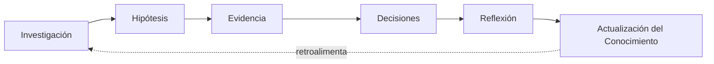

# MOC - Cognición

`Sistema/Cognición/` documenta el comportamiento cognitivo que la IA debe ejecutar — no software, no plugins. Se organiza en tres ejes ortogonales (ver [[Arquitectura Cognitiva del Sistema]] §9).

## (a) Ciclo — las seis etapas secuenciales

- [[Protocolo|Investigación]] · [[Checklist|Checklist de Investigación]] · [[Heurísticas|Heurísticas de Investigación]] · [[Preguntas|Preguntas de Investigación]]
- [[Protocolo|Hipótesis]] · [[Checklist|Checklist de Hipótesis]] · [[Heurísticas|Heurísticas de Hipótesis]] · [[Preguntas|Preguntas de Hipótesis]]
- [[Protocolo|Evidencia]] · [[Checklist|Checklist de Evidencia]] · [[Heurísticas|Heurísticas de Evidencia]] · [[Preguntas|Preguntas de Evidencia]]
- [[Protocolo|Decisiones (motor)]] · [[Checklist|Checklist de Decisiones]] · [[Heurísticas|Heurísticas de Decisiones]] · [[Preguntas|Preguntas de Decisiones]]
- [[Protocolo|Reflexión]] · [[Checklist|Checklist de Reflexión]] · [[Heurísticas|Heurísticas de Reflexión]] · [[Preguntas|Preguntas de Reflexión]]
- [[Protocolo|Actualización del Conocimiento]] · [[Checklist|Checklist de Actualización del Conocimiento]] · [[Heurísticas|Heurísticas de Actualización del Conocimiento]]

(Nota: varios archivos comparten nombre entre carpetas de motor — ej. `Protocolo.md` — Obsidian los desambigua por ruta; usa la búsqueda o el explorador de archivos dentro de `Sistema/Cognición/Ciclo/<Motor>/` si un enlace resulta ambiguo.)

## (b) Marcos de Razonamiento — herramientas transversales

No son una etapa más del ciclo: son lentes metodológicos combinables, usados dentro de cualquier motor. Ver [[Índice - Marcos de Razonamiento]] para la tabla completa de marcos recomendados por motor.

## (c) Metacognición — capa supervisora

Puede activarse durante cualquier motor del ciclo, distinta de Reflexión (que ocurre después de cerrarlo). Ver `Sistema/Cognición/Metacognición/Protocolo.md`.

## (d) Integración de datos externos

No es una cuarta etapa secuencial del Ciclo ni un cuarto eje formal — es una capacidad transversal invocable desde cualquier motor, igual que un Marco de Razonamiento puede usarse dentro de cualquier motor. Da acceso a datos conductuales reales de Zam desde una base de datos viva, y desde 2026-08-06 también incluye escritura estructurada (asignación y cierre de tareas, resúmenes de sesión) bajo pedido explícito de Zam. Ver [[Protocolo de Ingesta de Datos Cuantitativos]] (solo lectura), [[Protocolo de Asignación de Tareas Personalizadas]] (lectura + escritura) y [[Zam App — Base de datos de autorregistro (Supabase)]].

## (e) Formato de respuesta — Teórico-Práctica

No es una capacidad de razonamiento sino de la Interfaz Conversacional: define cómo se empaqueta una respuesta ya razonada cuando Zam reporta un impulso, hábito, sensación o patrón en tiempo real. Ver [[Protocolo de Respuesta Teórico-Práctica]].

## Fundamentos

Las reglas de conocimiento que estos tres ejes aplican viven en [[Epistemología del Sistema]]. La descripción completa de componentes y flujo vive en [[Arquitectura Cognitiva del Sistema]].

## Ver también

[[Índice]] · [[Arquitectura Cognitiva del Sistema]] · [[Epistemología del Sistema]] · [[Índice - Marcos de Razonamiento]] · [[Protocolo de Respuesta Teórico-Práctica]]
